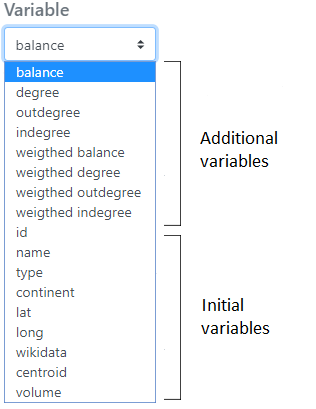

# Data pre processing

After loading the data, the creation of a flow map with Arabesque can be broken down into the following main steps.

::: {.callout-tip appearance="simple"}
## Flow mapping tips

1.  Importing flow data (links/nodes)
2.  Processing flow data (automatic indicators calculation, ...)
3.  Geographical data computing (layering, ...)
4.  Statistical data computing (filtering, ...)
5.  Designing links and arrows (geometry and semiology)
6.  Designing nodes (semiology)
7.  Map cosmetics (title, sources, ...)
8.  Export
:::

The links and nodes datasets are automatically modified by creating new columns when importing. Arabesque computes different key indicators and a default flow map is suggested.

## Indicators on links

Three indicators are automatically calculated on the links.

**distance:** euclidean distance between the origin and destination entities is calculated (in WGS1984 projection).

**balance:** corresponds to the *bilateral balance*, calculated as the difference of the flow value from (A to B) - (B to A). For migrations for example, it corresponds to *net immigration*.

**gross flow:** correspond to the *bilateral volume*, calculated as the sum of the flow value from (A to B) + (B to A).

## Indicators on nodes

A list of various simple and weighted indicators are calculated on the nodes, with reference to the Social Network Analysis (SNA) theory, are proposed.

**balancedegree**: difference between the number of in and out degrees.

**outdegree**: number of outgoing links from a place.

**indegree**: number of ingoing links from a node/place.

**weigthed balance**: difference between the number of in and out degrees weighted by the flow value.

**weigthed degree**: difference between the number of in going and outgoing links weighted by the flow value.

**volume**: is the sum of the incoming and outgoing flow values for each node. In other words: sum between row and column marginal sums.

**balance**: corresponds to the difference between the sum of the incoming flow values and the sum of the outgoing flow values for each node. in other words: the difference between the row and column marginal sums.

**Asymmetry**:corresponds to the ratio of the balance (balance) to the volume of flows.

See below the additional indicators automatically calculated on the nodes of the RIcardo data

See below the **Additional variables** that have been automatically computed (ie the additional variable) on the nodes of the RIcardo data set.

These indicators can be downloaded in . csv format (see Export and Save sections).

## Suggested default flowmap

Loading data in Arabesque leads to the creation of a default map to avoid visualizing a "spaghetti effect" when entering the application ; all the defined parameters can then be modified during the exploration.

By default, the links are represented in shades of blue and the nodes in red. The map is presented in the WGS84 projection, according to the lat/lon coordinates declared during the import.

Except in the case of loading a projected geometry as input, the map is presented in WGS84.

Hereby is the Mobscol dataset default map in the central panel.

For all default map, only a small percent (around to 10 - 20% depending on the flow dataset) of the most important links (in value) are drawn according to their intensity of the declared flow variable at import.

The corresponding nodes are symbolized according to their degree (automatically calculated variable during the import).

The right-hand panel shows :

\- overall statistics on the proportion of flow information represented on the map ;

\- a flow value distribution diagram

All graphic and data filtering parameters can be modified using the left (geography and graphical semiology) and right (statistical filtering) panels.
