# Designing the links/arrows

This chapter concerns the drawing of the links features : their geometry/shape and their semiology.

Sign parameters are set on the left panel - in the layer management section ie. the lower part, which displays at least two geographical layers : one on links and one on nodes.

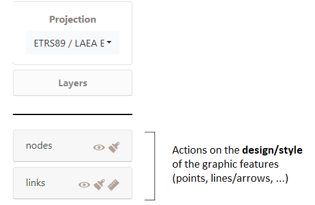

::: callout-note
## Note:

Other geographic information layers (tiles, ...) can also be displayed in this section.
:::

## Designing the links

the design of the links can be modified in two ways: their semiology and their geometry by using the following icons:

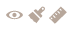 Modify the style of the links

## Links' semiology

 Three semiological parameters are available for designing the links : their color, their size and their opacity.

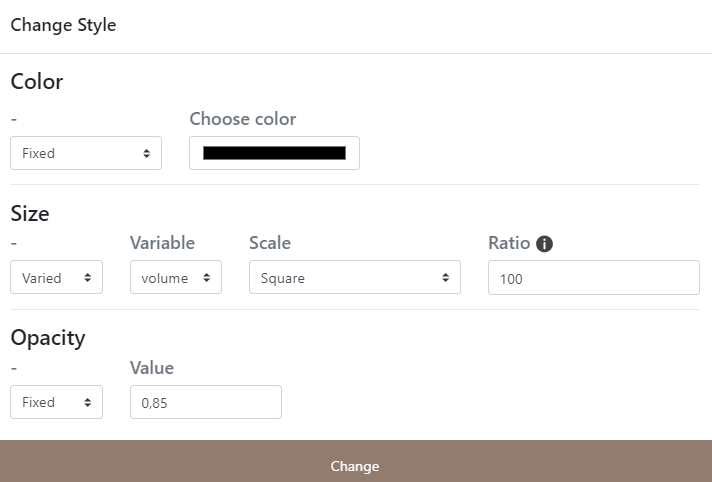

### Links' color

The colour of the links can be set according to three criteria: a colorimetric space, a variable ; the type of the variable.

#### Setting the colorimetric space

The colour/tone of the links can be defined in the following three spaces, by clicking on the double arrow icon :

\- Red Green Blue (RGB)

\- Hue, saturation, luminosity (HSL)

\- HEXagesimal (HEX)

#### Setting modes of the color

-   **Fixed mode of color** means that the ton is identical for all nodes.

-   **Conditional mode** means that the color of the **nodes will vary** according to several parameters.

The color/tone can vary according to a specific variable and its type.

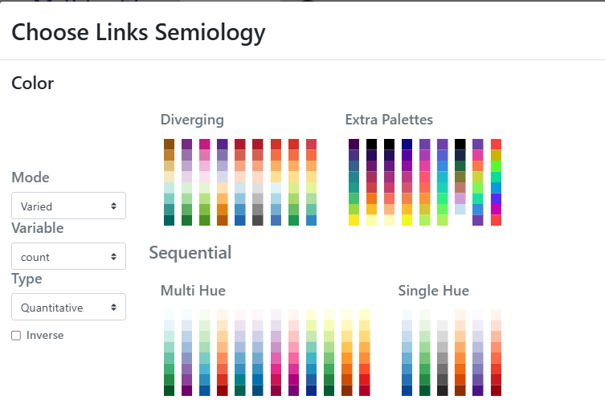{fig-align="left"}

The reference for the color schemes is Cynthia Brewer palette for Diverging, Multi Hue and Single Hue. See: [Color Brewer advices for maps](https://colorbrewer2.org/#type=sequential&scheme=BuGn&n=3). An Extra Palettes is also proposed in Arabesque.

#### Color variation as a function of a variable

The color of the links can be set according to one of the variables (initial or calculated by Arabesque) that are available in the dataset.

#### Color variation as a function of the type of a variable

::: {.callout-caution appearance="simple"}
### Caution

The type of color range (Diverging/Multi Hue/Single Hue/Extra Palette) will have to be realized according to the type of the variable to represent (quantitative/qualitative, discrete/continuous, stock/ratio/scale, ...).
:::

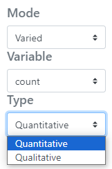{fig-align="left"}

The progression (up/down) of the **color range** depends on that of the **value range**: it can be direct or inverse. The checked box means an inverse progression: a light color is applied to a strong value.

### Links' stroke

The outline of the lines or arrows can be modified: their color and their thickness (between 0 and 1 px).

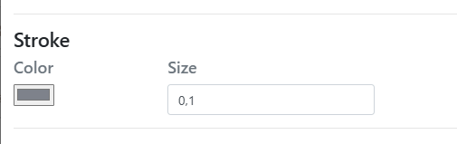

### Links' size

The size of the links can be fixed for all links or vary according to a quantity, corresponding to one of the quantitative variables available in the edge file (for native or calculated at import).

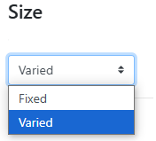{fig-align="left"}

The choice of the varied option then leads to selecting the variable to consider?

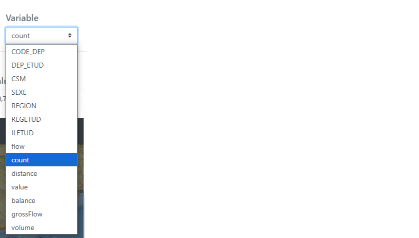{fig-align="left"}

The graphic width of the links can be parameterized according to three scales: linear, square root and logarithmic.

This choice must be decided according to the distribution of your flow dataset. It can be achieved by applying a filter to the value to be mapped.

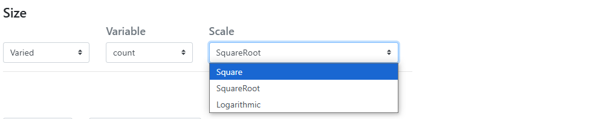{fig-align="left"}

The parameterization of the ratio parameter makes it possible to balance the drawing of the flows with respect to the whole of the map and to the bounding box, and, so that the draw lines are neither too wide nor too thin. This parameter is subjective and must be assessed according to the phenomenon and the audience receiving the map.

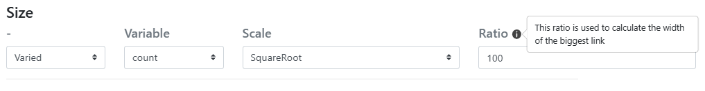

### Links' opacity

The transparency of the color of the links can be fixed for all links or vary according to a quantity, corresponding to one of the quantitative variables available in the edge file (for native or calculated at import).

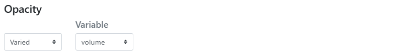{fig-align="left"}

The transparency can be parameterised according to four scales: linear, square, square root and logarithmic.

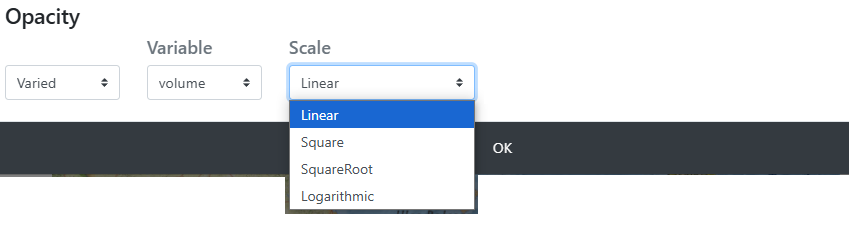{fig-align="left"}

The opacity value, between 0 and 1, is set for one or two values (minimum and/or maximum).

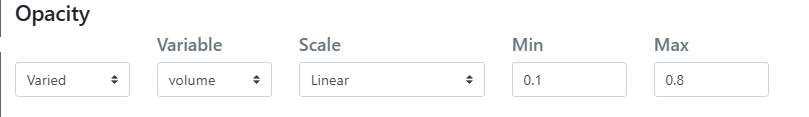

## Links' geometry parameters

Geometry parameter is to change arrow shape

 Three geometrical parameters are available for designing the links : their shape, their type, their arrow head and their width

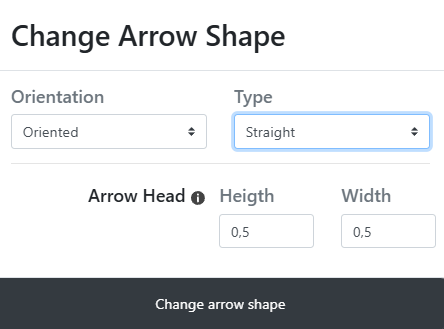

### Links' orientation

The link can be oriented in the form of an arrow or not (remain as a simple line).

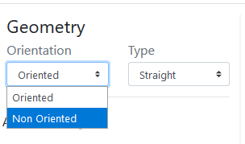

Oriented geometry takes into account the direction of the **flow** to define the **graphic form** of the sign.

::: {.callout-note appearance="simple"}
## Note about to the orientation

The link's orientation is related to the declared from-to parameter adjusted when the links were imported. See Data importation chapter.
:::

### **Link's types**

Five forms of flow lines are available.

-   **straight** ;

-   **straight no hook** ;

-   **triangle** ;

-   (line) **curve**

-   **Triangle curve**.

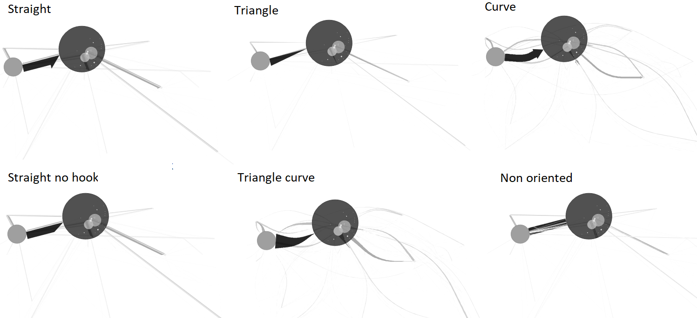

-   **Straight** (as euclidian distance symbolisation): The link is straight and oriented, with a half arrowhead.

-   **Straight no hook**: The link is straight and oriented, it has a point without hook.

-   **Triangle**: The link is straight and takes the shape of a triangle.

-   **Curve** : The link is curved and oriented, its curvature is configurable in the Arrow head section if selected.

-   **Triangle curve**: The link is curved and takes the shape of a drop of water, its curvature is configurable in the Arrow head section if selected.

-   **Non oriented**: The link is straight, valuate or not, it has no direction.

The arrow geometry - which corresponds to the visual shape variable - can be rectilinear or curvilinear.

### Design of linear arrows

The **straight** and **straight no hook** type of line (oriented as arrows or not) is for rectilinear flow features.

Only the **arrow head** can be set if required.

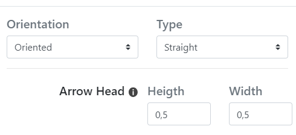

-   **Arrow head-Height** (curve): The value of the height of the head is the percentage of the map distance of the link (distance between the origin and the destination) used to define the maximum (map) width of the link

-   **Arrow head-Width** being itself a function of the value of the flow, but it can be set as constant here.

### Design curved lines/arrows

The curvature of the line is generated according to the Chaikin algorithm which allows to parameterize its height and its base, with respect to the body of the link.

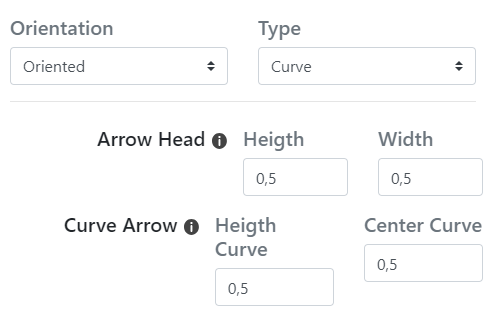{fig-align="left"}

-   **Height curve**: the (\[0,5\] is identified as a distance from the origin node of the link. Here, the point is approximately in the middle of the curve.

-   **Center Curve:** the value of (\[0,5\]) is that of the center of the curve for a pseudo 3D rendering.
