# Designing the nodes

This chapter concerns the drawing of the nodes, especially the configuration of their graphical semiology. Nodes are currently drawn exclusively in the form of circles.

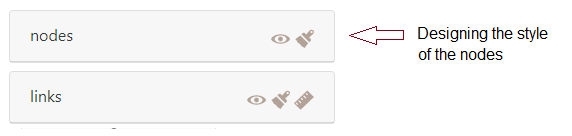{fig-align="left"}

::: {.callout-note appearance="simple"}
## Note

Note: other geographic information layers (tiles, ...) can also be displayed in this section.
:::

## Nodes semiology

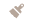 Three semiological parameters are available for designing the nodes : their background color (tone, hue, saturation) and its opacity ; their outline (thickness and color) ; their size (fixed or variable according to a quantity) and the display of one label.

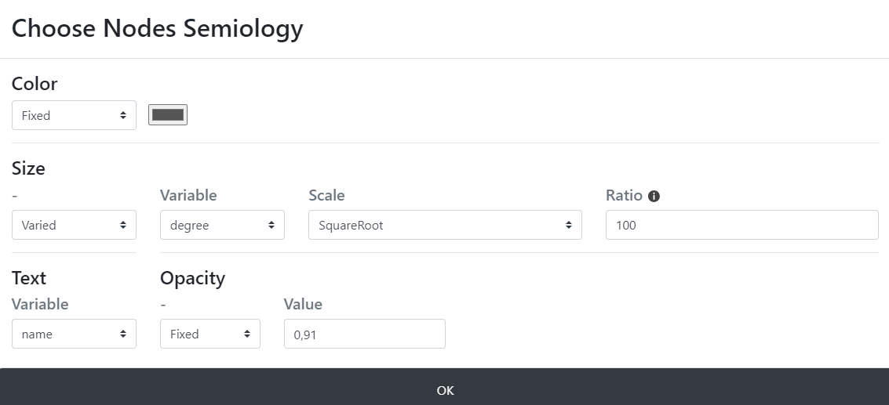{fig-align="left"}

## **Nodes' color**

The colour of the nodes can be set according to three criteria: a color setting mode, a variable and the type of the variable.

### Setting the colorimetric space

the colour/tone of the nodes can be defined in the following three spaces, by clicking on the double arrow icon 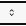:

\- Red Green Blue (RGB)

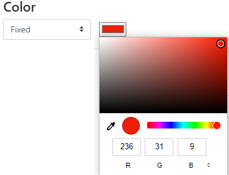

\- Hue, saturation, luminosity (HSL)

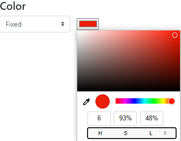

\- HEXagesimal (HEX)

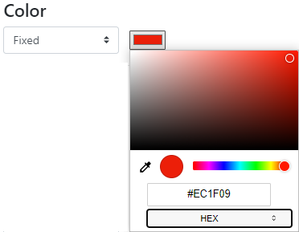

### Setting modes of the color

-   **Fixed mode of color** means that the ton is identical for all nodes.

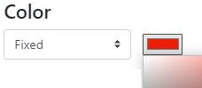

-   **Conditional mode** means that the color of the **nodes will vary** according to several parameters.

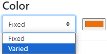

The color/tone can vary according to a specific variable and its type.

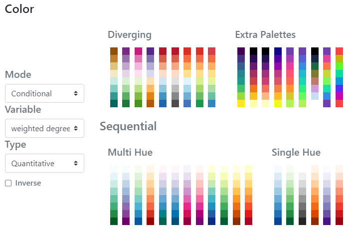{fig-align="left"}

The reference for the color schemes is Cynthia Brewer palette for Diverging, Multi Hue and Single Hue. See: [Color Brewer advices for maps](https://colorbrewer2.org/#type=sequential&scheme=BuGn&n=3). An Extra Palettes is also proposed in Arabesque.

### Color variation as a function of a variable

The color of the nodes can be set according to one of the variables (initial or calculated by Arabesque) that are available in the dataset.

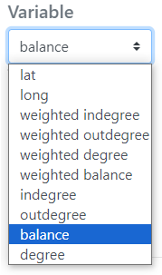

### Color variation as a function of the type of a variable

::: {.callout-caution appearance="simple"}
## Caution

The type of color range (Diverging/Multi Hue/Single Hue/Extra Palette) will have to be realized according to the type of the variable to represent (quantitative/qualitative, discrete/continuous, stock/ratio/scale, ...).
:::

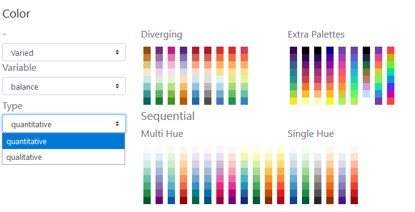

The progression (up/down) of the **color range** depends on that of the **value range**: it can be direct or inverse. The checked box means an inverse progression: a light color is applied to a strong value.

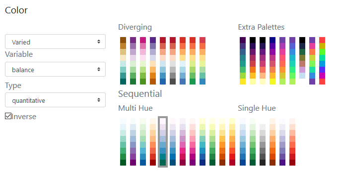

## **Node's stroke**

The outline of the nodes can be modified: their color and their thickness (between 0 and 1 px).

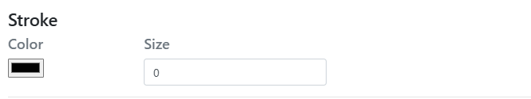{fig-align="left"}

## **Node's size**

The size of the nodes can be fixed and the weight defined.

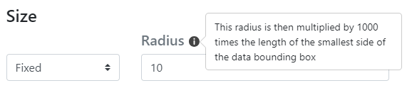

### Nodes' size weighted by a variable

The size of the nodes can be **weighted by a variable** according to one of the initial or additional **variables** available in the dataset (hereby the balance).

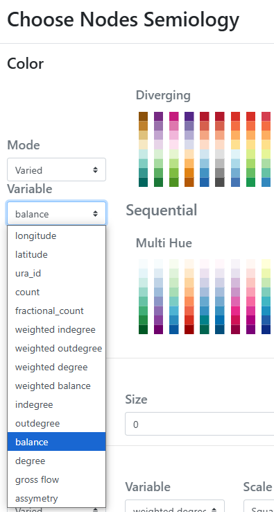

Three functions to set the size of the node according to the corresponding value are proposed: linear, square, square root and logarithmic.s

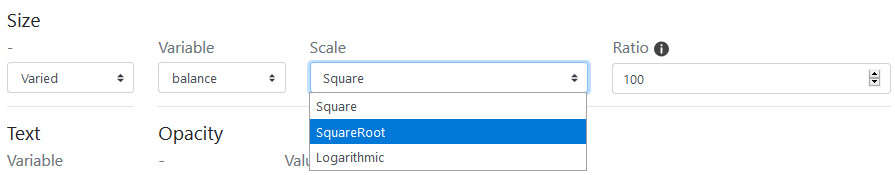

### Nodes' size ratio

The **ratio** representing the max width in pixel of the graphic features can be defined - according to the map bounding box, to obtain an image with balanced features (neither too small nor too big).

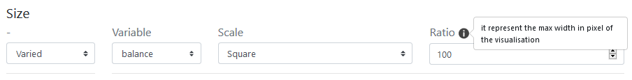

## **Node's Text**

Text can be displayed as node labels.

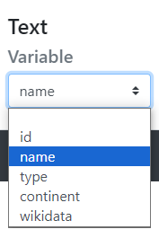

The text can be defined according to one of the variable available in the nodes' data set, here the name, the type, etc..

## **Node's Opacity**

The transparency of the color of the nodes can be fixed for all of them.

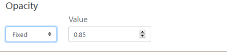

The nodes' opacity can also vary according to a quantity, corresponding to one of the quantitative variables available in the nodes file, for native or calculated indicators at import.

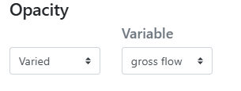

The transparency can be parameterised according to four scales: linear, square, square root and logarithmic.

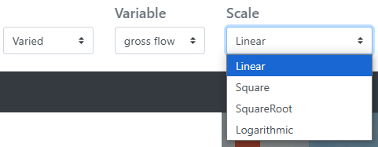

The opacity value, between 0 and 1, is set for one or two values (minimum and/or maximum).

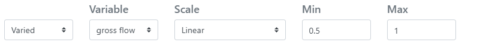

## The nodes' geometric parameters

Not implemented yet. Upcoming projects.
