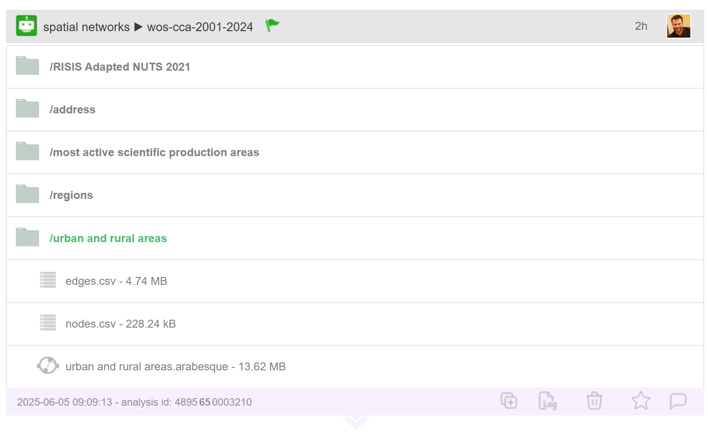

# Arabesque interoperability

One of the new features of Arabesque2 is its interoperability with dedicated network processing applications, which use its filtering and geovisualisation functionalities.

## CorText manager

Cortext Manager is a publicly available web application providing data analysis methods curated and developed by a team of researchers and engineers. Upload a textual corpus in order to analyse its discourse, names, categories, citations, places, dates etc, with methods for science/controversy/issue mapping, distant reading, document clustering, geo-spatial and network visualizations, and more.

### How to play with Arabesque ?

You can jump straight to [Cortext Manager](https://managerv2.cortext.net/) and create an account, but we suggest taking a look at the [Documentation](https://docs.cortext.net/) and [Tutorials](https://docs.cortext.net/training-materials/) as you start your journey.

### What is it ?

Cortext Manager the main attraction of Cortext Plateform and our goal is to empower researchers by promoting advanced qualitative-quantitative mixed methods. Our primary focus is on studies about the dynamics of science, technology and innovation, and about the roles of knowledge and expertise in societies. We understand the move towards digital humanities and computational methods not as addressing a technological gap for the social sciences, but rather as entailing entirely new assemblages between its disciplines and those of modern statistics and computer sciences. And we work to tackle ever more complex research problems and deal with the profusion of new and diverse sources of information without losing sight of the situatedness and reflexivity required of studies of human societies.

### Credits

Cortext is hosted by the [LISIS](http://umr-lisis.fr/) research unit at Université Gustave Eiffel, and was launched by French institutes [IFRIS](http://www.ifris.org) and [INRAE](http://www.inrae.fr), receiving their continued support.

## Netscity

::: {.callout-note appearance="simple"}
## Note

If you want to add a note, please use this.
:::
