# Gallery

Hereby are examples of flow maps made with Arabesque, sorted by main topic.

## **Sustainable Development and adaptation to climate change**

### Food supply network (short food delivery from Logicout)

Short food delivery rounds declared by users of the [Logicout](https://logicout.fr/couts/) online application, enabling the cost and carbon impact of short-distance deliveries to be calculated).

Geography of short food circuits declared in the Logicout database in 2024.

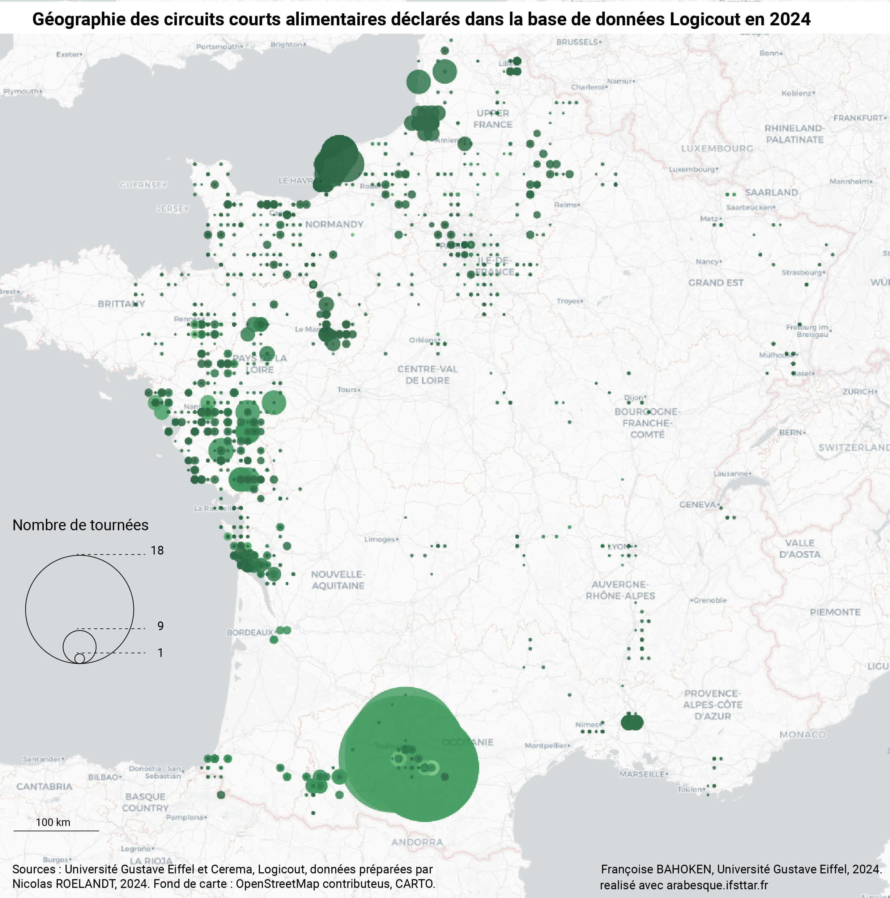

Short food circuits declared in euros in the Logicout database in 2024.

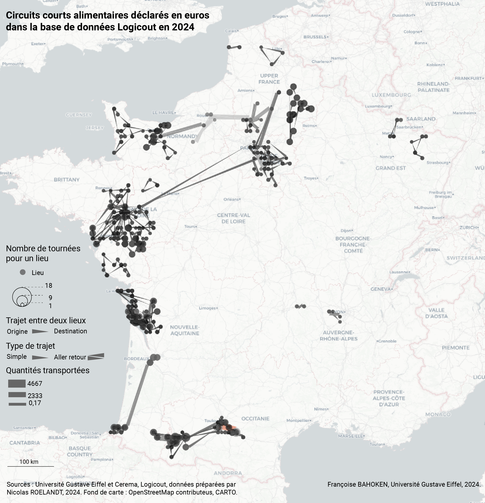{fig-align="left"}

**Flow mapping:** Françoise Bahoken (Univ. Gustave Eiffel), 2024. \
**Note:** Flow maps layout in drawing software.

**Data source:** [Logicout](https://logicout.fr/couts/) database, Univ. Gustave Eiffel and Cerema. Data compiled by Nicolas Roelandt, Univ. Gustave Eiffel, 2024.

**Based map:** Open Street Map contributors.

**References:** Gwenaëlle Raton, [Logicout, présentation](https://splott.univ-gustave-eiffel.fr/la-recherche/logicout), Univ. Gustave Eiffel, Département Aménagement, mobilités, environnement. (AME), laboratoire Splott.

### Tree species and climate conditions scientific collaborations

Tree species and climate conditions topic collaborations over to nine publications in 2024, between cities 5,000 kilometers away from each other.

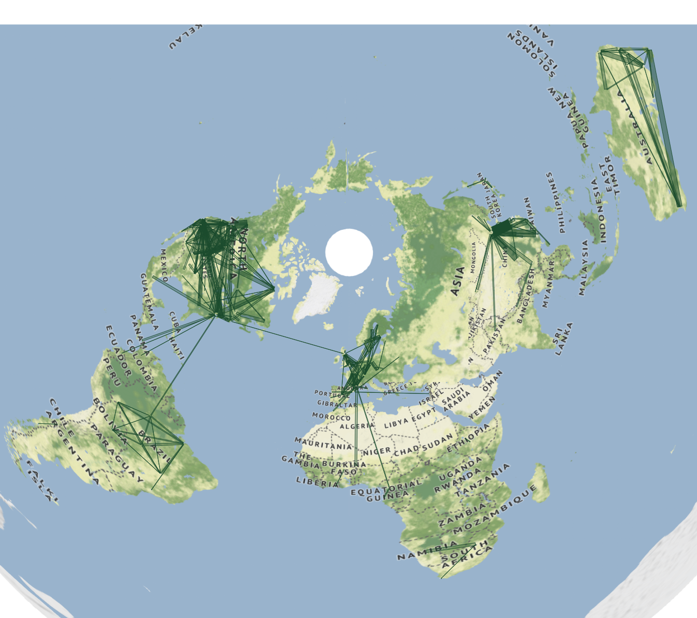{fig-align="left"}

Tree species and climate conditions topic collaborations over to nine publications in 2024, between cities 5,000 to 12,000 kilometers away from each other.

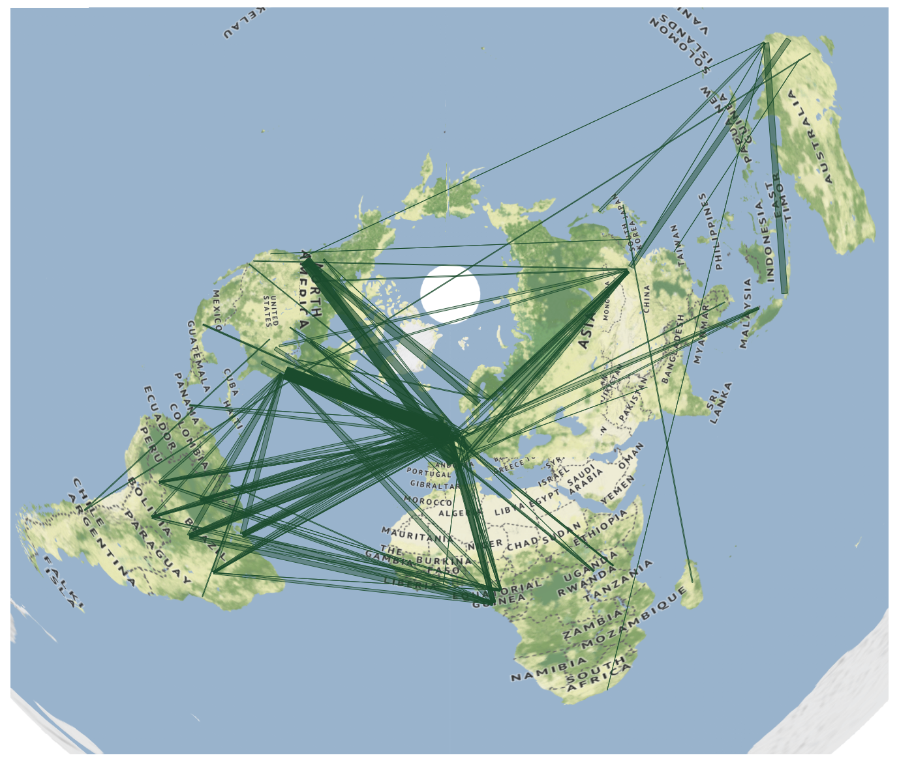

Tree species and climate conditions topic collaborations over to five publications in 2024, between the cities of the Gulf of Guinea.

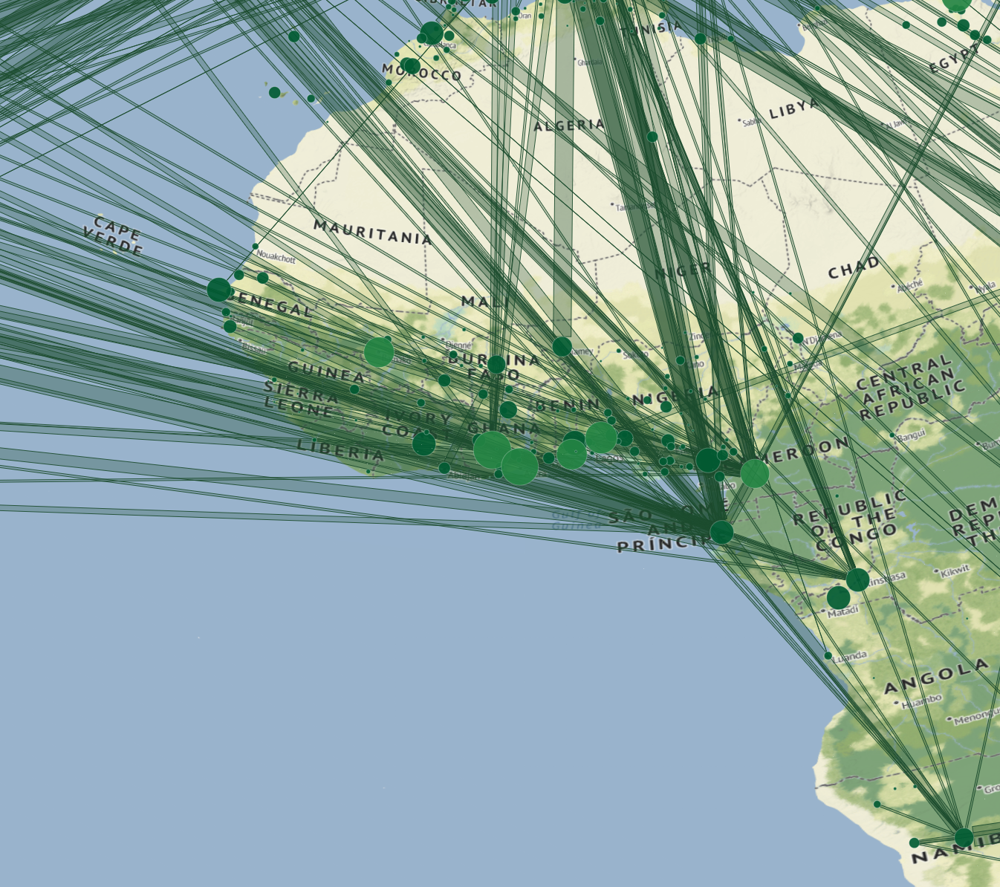

**Flow mapping:** Françoise Bahoken (Univ. Gustave Eiffel), 2025.

**Data source:** Web of Sciences (WOS), International scientific collaborations on the theme "Tree species and climates conditions". Data compiled by Lionel Villard (Univ. Gustave Eiffel) and Étienne Côme (Univ. Gustave Eiffel).

**Based map:** Stamen Terrain, with equidistant conic cartographic projection.

**References:** RETICULAR program, Univ. Gustave Eiffel. 2025. Made with CorText Manager and Arabesque.

### Temperature topic scientific collaborations

Urban heat island and air temperature topic collaborations between cities in 2021.

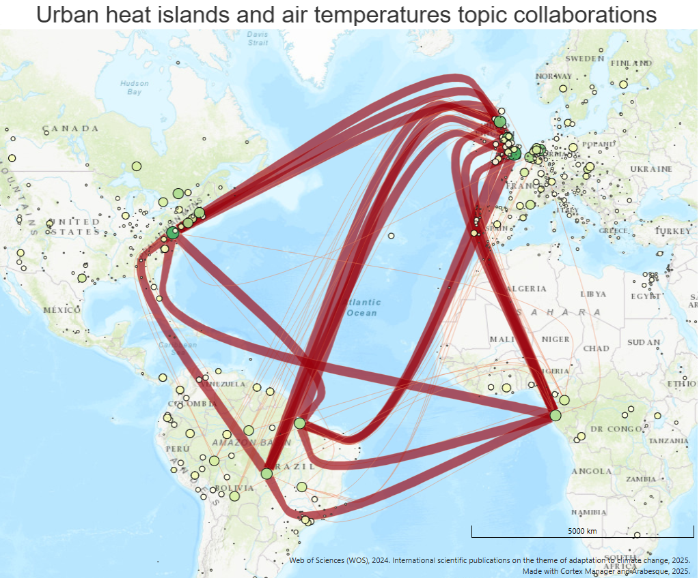

**Flow mapping:** Françoise Bahoken, Etienne Côme and Lionel Villard (Univ. Gustave Eiffel)

**Data source:** Web of Sciences (WOS), International scientific collaborations on the theme "Climate changes in urban areas".

**Based map:** ESRI World topographic map.

**References:** RETICULAR program, Univ. Gustave Eiffel. 2025.

## **Human mobilities**

### African migrants in malaria endemic countries

Estimated internal human migrants flows from 2005 to 2010 between sub-national administrative units for malaria endemic countries.

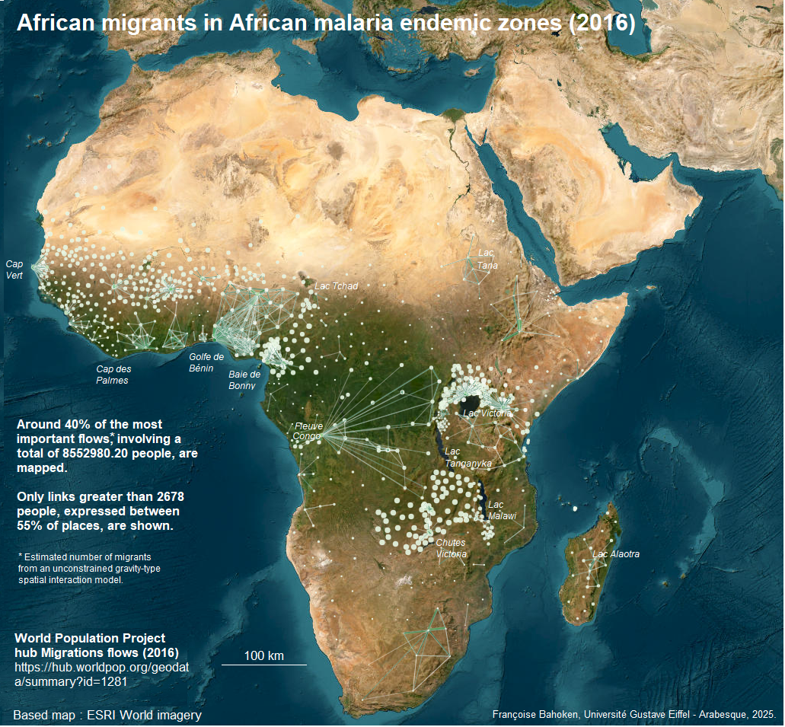{fig-align="left"}

**Flow mapping:** Françoise Bahoken (Univ. Gustave Eiffel), 2025.\
**Note:** Flow map layout in drawing software.

**Data source:** Estimated internal human migration flows between subnational administrative units for malaria endemic countries (WHO, 2015). See [Documentation](http://www.who.int/malaria/publications/country-profiles/en/). [Data Descriptor](https://www.nature.com/articles/sdata201666.pdf). Sorichetta A. *et al*. Mapping internal connectivity through human migration in malaria endemic countries. Sci Data 3, 160066 (2016). https://doi.org/10.1038/sdata.2016.66

**Based map:** ESRI World imagery.

**References:** Françoise Bahoken (5 mai 2025). [Flux de migrants en zone endémique paludéenne](https://doi.org/10.58079/13v61) (2016). *Carnet (neo)cartographique*. Sorichetta, A., Bird, T., Ruktanonchai, N. et al. Mapping internal connectivity through human migration in malaria endemic countries. Sci Data 3, 160066 (2016). https://doi.org/10.1038/sdata.2016.66

### Covid 2020 french migration

Inter french department post covid migrations over than 800 people and less than 200 kilometers.

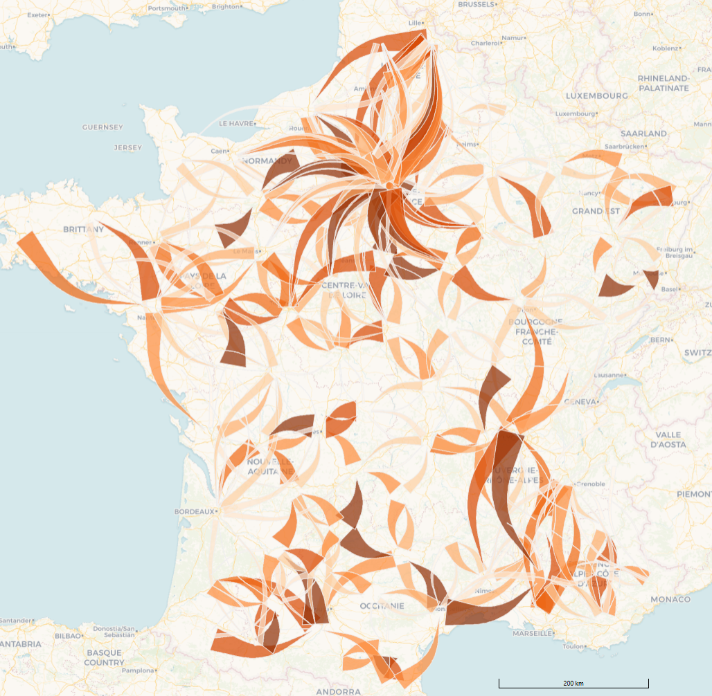{fig-align="left"}

**Flow mapping:** Francoise Bahoken (Univ. Gustave Eiffel, 2020.

**Data source:** Bouygues Telecom, Orange Business Services France, SFR and INSEE, 2020. See [documentation](https://www.insee.fr/fr/statistiques/4635407#documentation)

**Based map:** CARTO database voyager labeled.

**References:** Galiana, L., Suarez Castillo, M., Sémécurbe, F. Coudin, E., de Bellefon, M.-P. (2020), "Retour partiel des mouvements de population avec le déconfinement", Insee Analyses N°54, INSEE.

### Summer car-sharing in France in 2022

Number of carpooling journeys made in France in August 2022 (450,000 movements between 7,800 municipalities).

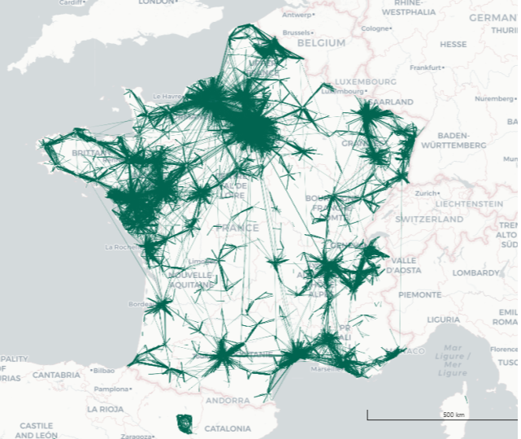{fig-align="left"}

**Flow mapping:** Francoise Bahoken (Univ. Gustave Eiffel), 2023.

**Data source:** Registre de preuve du covoiturage, 2022. See [//covoiturage.beta.gouv.fr](https://covoiturage.beta.gouv.fr/)

**Based map:** Open Street Map contributors.

**References:** Françoise Bahoken, *Arabesque*, Journée d'étude :"La boite à outils de cartographie et de géovisualisation de données. Regards croisés de chercheurs ([JE Rennes](https://github.com/magisAR9/JEGeovizRennes)), Action de recherche n°9 (Carto)graphies et (géo)visualisation de données, GdR CNRS MAGIS, Rennes, 2023.

### School mobility in France

School mobility in 2021: all journeys between home and place of study, aggregated by departments.

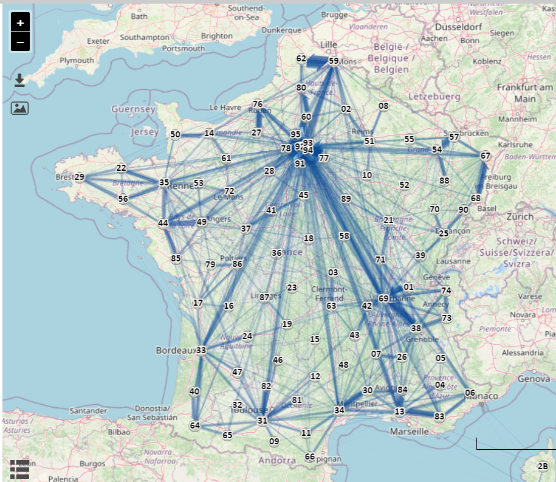

School mobility in 2021 between home and place of study less than 200 kilometers.

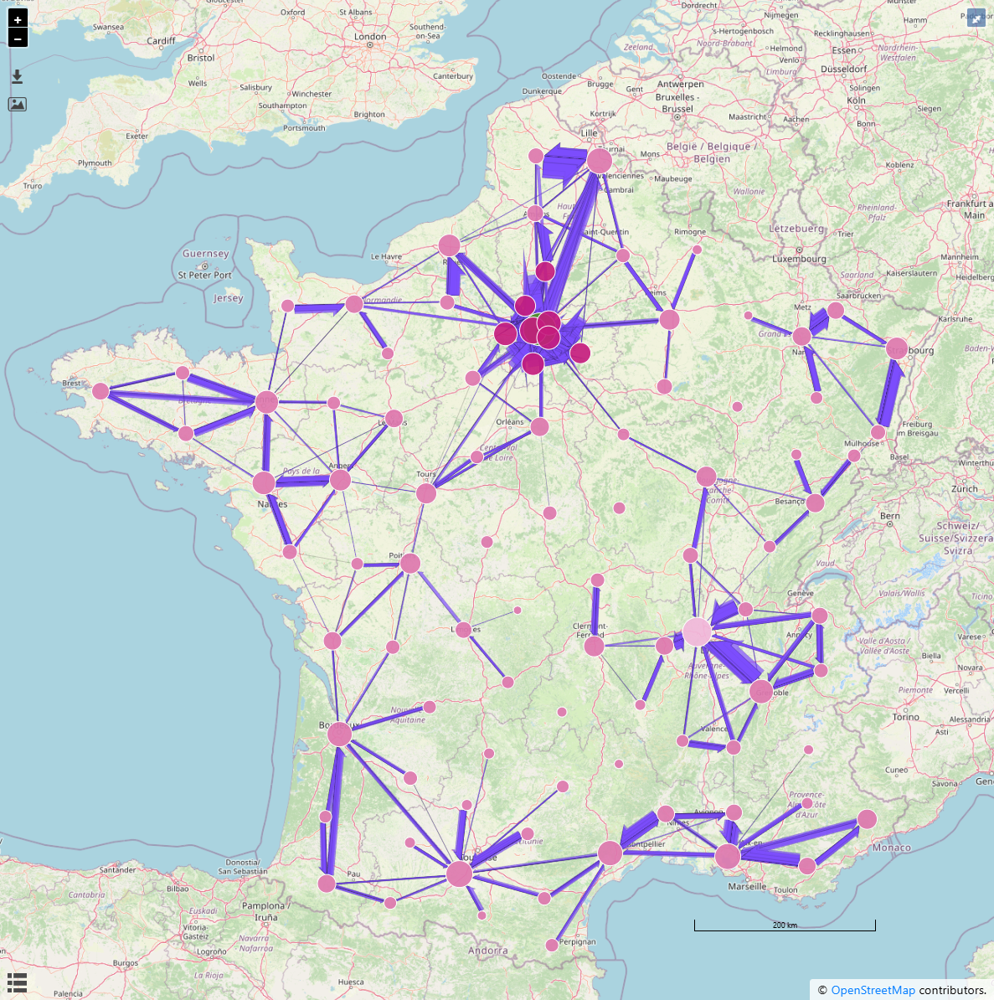{fig-align="left"}

**Flow mapping:** Francoise Bahoken (Univ. Gustave Eiffel), 2025.

**Data source:** French Population Census - Mobility flows database. School mobility (MOBSCOL), INSEE, 2020. See [Documentation](https://www.insee.fr/fr/statistiques/8201894).

**Based map:** Open Street Map contributors.

### Domestic passengers flows in France in 2019

Total number of passengers between French airports in 2019 : local passengers and transit passengers, without double counting.

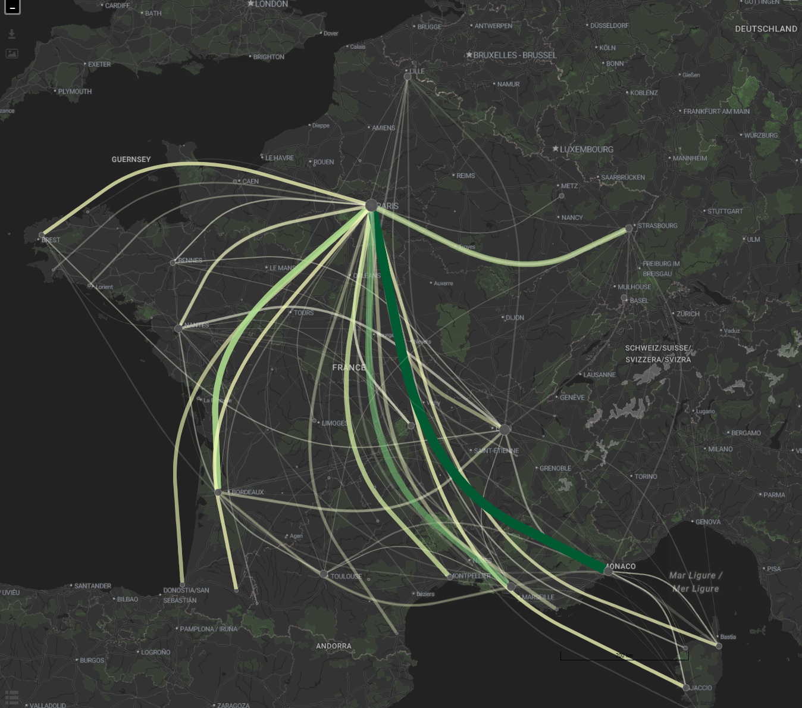{fig-align="left"}

**Flow mapping:** Françoise Bahoken, 2025

**Data source:** Étienne Côme and Laurent Jégou (*gflowiz team)* for the Cartomob international conference's mapathon, 2020. Direction générale de l'aviation civile (2020), *Bulletin statistique : trafic aérien commercial année 2019*, Ministère de la transition écologique et solidaire MTES, Eurostats (2020), *Transport database*. See [Documentation](https://cartomob.sciencesconf.org/resource/page/id/16.html?lang=fr).

**Based map:** Stadia Stamen dark.

**References:** *gflowiz team,* [Cartomob international conference mapathon](https://github.com/gflowiz/mapathon/tree/master), 2020.

### International refugees in 2017

Refugees and internally displaced persons in 2017. Migrants flows of more than 10,000 people and less than 5,000 kilometers.

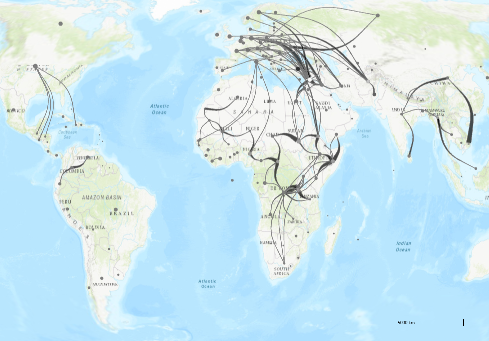

**Flow mapping:** Francoise Bahoken (Univ. Gustave Eiffel), 2025.

**Data source:** United Nations, UNHCR. 2015

**Based map:** ESRI World topographic map.

### International migration stock

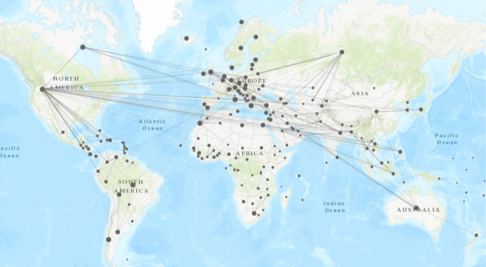

**Flow mapping:** Francoise Bahoken (Univ. Gustave Eiffel), 2023.

**Data source:** International migrant stocks, United Nations, 2019.

**Based map:** ESRI World topographic map.

## **Animal migrations**

### European birds migration

Nocturnal bird migration (one particular night) based on data from the European network of weather radars.

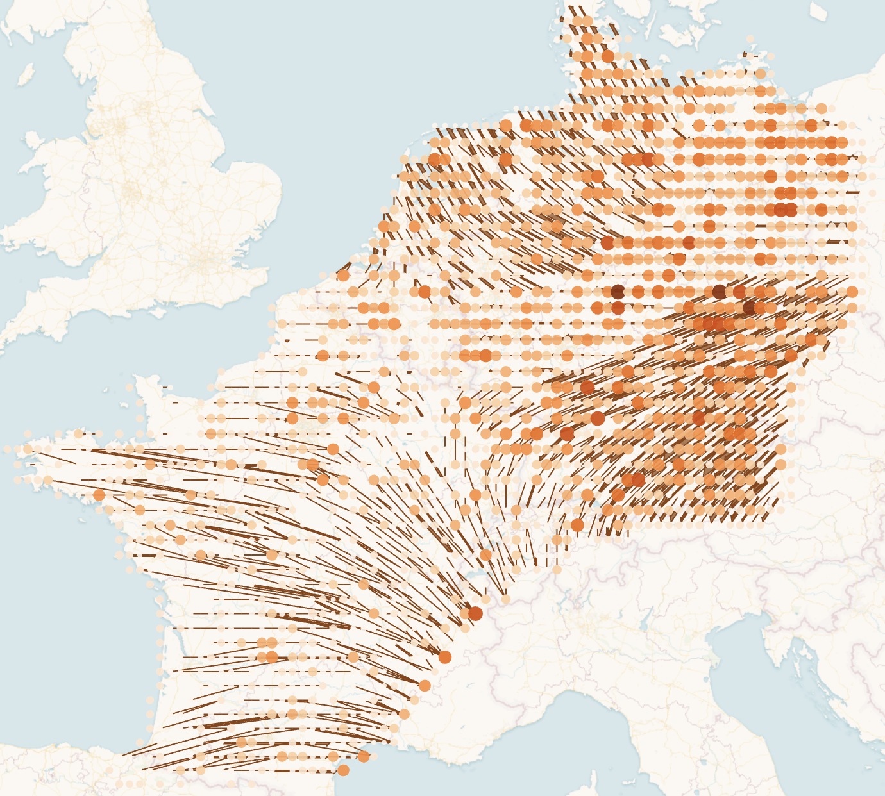{fig-align="left"}

**Flow mapping:** Françoise Bahoken (Univ. Gustave Eiffel), 2025.

**Data source:** Raphaël Nussbaumer, [Bird migration modelling (BMM)](https://birdmigrationmap.vogelwarte.ch/), 2018.

**Based map:** CARTO Database with no labels.

**References:** Raphaël Nussbaumer,Silke Bauer, Lionel Benoit, Grégoire Mariethoz, Felix Liechti and Baptiste Schmid (2021), Quantifying year-round nocturnal bird migration with a fluid dynamics model, Royal Society Publishing. <https://doi.org/10.1098/rsif.2021.0194>

## **Goods and trade flows**

### French total freight in 2019

Domestic total freight between French airports

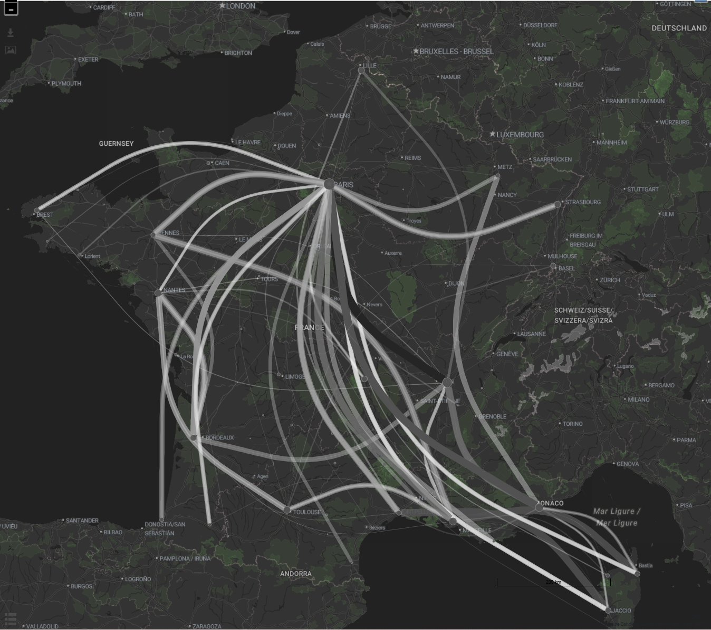

**Flow mapping:** Françoise Bahoken, 2025

**Data source:** Étienne Côme and Laurent Jégou (*gflowiz team)* for the Cartomob international conference's mapathon, 2020. Direction générale de l'aviation civile (2020), *Bulletin statistique : trafic aérien commercial année 2019*, Ministère de la transition écologique et solidaire MTES, Eurostats (2020), *Transport database*. See [Documentation](https://cartomob.sciencesconf.org/resource/page/id/16.html?lang=fr)

**Based map:** Stadia Stamen dark.

**References:** *gflowiz team,* [Cartomob international conference mapathon](https://github.com/gflowiz/mapathon/tree/master), 2020.

### International flows of iron

Global circulation of scrap metal and iron raw materials in 2015.

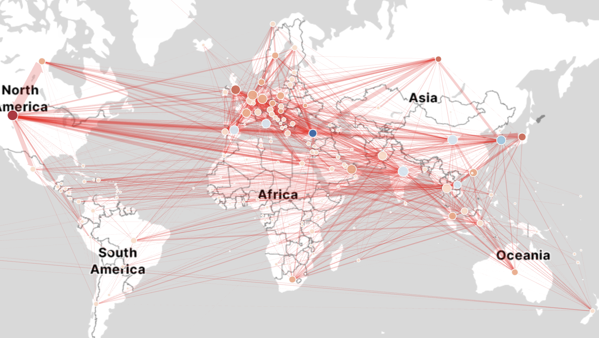

**Flow mapping:** Tony Hauck, 2025

**Data source:** Laurent Jégou, Marion Maisonobe, *International Comtrade database*, United Nations, 2017.

**Based map:** Stamen light.

**References:** Laurent Jégou, Marion Maisonobe, [*Explorer les réseaux mondiaux*](https://hal.science/hal-01854410v1) *: proposition d'outil interactif combinant graphe (diagramme nœuds-liens) et carte de flux*. CIST2018 - Représenter les territoires / Representing territories, Collège international des sciences du territoire. 2018. Mucem, exposition temporaire [Vies d'ordures. De l'économie des déchets](https://www.mucem.org/programme/exposition-et-temps-forts/vies-dordures), 2017.

### Historic international trade flow

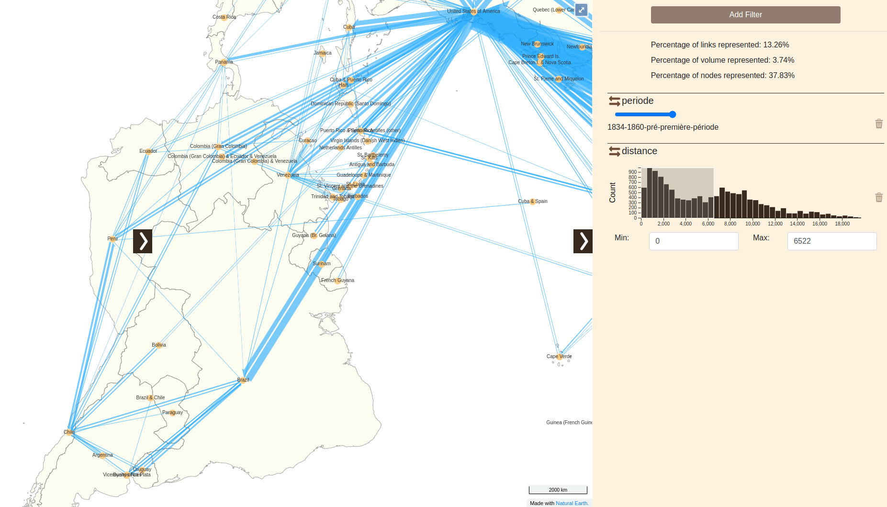

**Flow mapping:** Paul Girard (Sciences Po/medialab) and Béatrice Dedinger (Sciences Po/Centre d'Histoire)

**Data source:** RIcardo dataset. Medialab, Sciences Po, Paris. See [/github/RIcardo](https://github.com/medialab/ricardo_data).

**Based map:** Natural earth database countries.

**Reference:** Paul Girard, Béatrice Dedinger*Pourquoi et comment géolocaliser le commerce mondial des XIXe-miXXe siècles ? Retour d’expérience sur l’usage de wikidata comme gazetteer historique et de l’application de cartographie de flux Arabesque* [medialab/RIcardo\@humanistica2020](https://medialab.github.io/publications/geolocaliserRICardo@humanistica2020/). Béatrice Dedinger, & Paul Girard. (2017). RICardo dataset 2017.12 (Version 2017.12) \[Data set\]. Zenodo. <http://doi.org/10.5281/zenodo.1119592>
