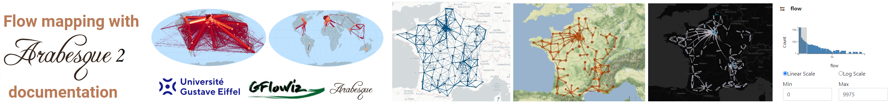

# Welcome !

{fig-align="left"}

This is the **Flow mapping with Arabesque** online book.

Arabesque is part of the Free and Open Source Software for Geospatial (FOSS4G) movement. It is a web application dedicated to flow mapping from origin-destination matrices and spatial networks datasets.

This books presents the functionnalities and how Arabesque 2 can be used to draw flowmaps.

It will be progressively updated following Arabesque 2 current development.

**Versions** - For the current version, go here: [Arabesque 2 : arabesque.univ-eiffel.fr](https://arabesque.univ-eiffel.fr/) - For the dev-version, go here: [Arabesque 2 - dev version](https://github.com/Tonhauck/dev-arabesque)

**Main keywords**: Origine-destination matrice, hyper matrice, multiplex graph, exploration, geovisualization, geoweb, flow mapping, movement mapping, semiology.

**About:** Arabesque is a part of the [**gFlowiz (geographic flow visualisation)**](#0) research project funded by IFSTTAR and then by Univ. Gustave Eiffel, a project involving several researchers and engineers in an interdisciplinary collaboration focusing on the geovisualisation of OD matrices. The group designed and developed a new web application dedicated to flow and spatial networks geovisualization.

See (in French only) : [geoflowiz research notebook/arabesque](https://geoflowiz.hypotheses.org/arabesque)

**Contacts**   [Françoise BAHOKEN & Étienne CÔME](mailto:francoise.bahoken@univ-eiffel.fr,etienne.come@univ-eiffel.fr), Univ. Gustave Eiffel.

Arabesque and its documentation is under BSD 2-Clause License,   Copyright (c) 2024-, Univ. Gustave Eiffel. All rights reserved.
