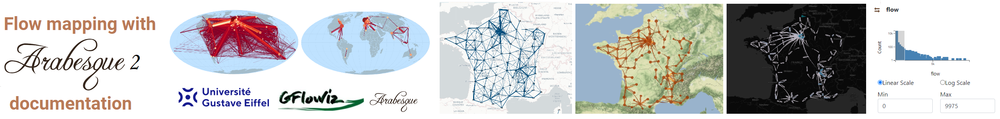

# Welcome ! {.unnumbered}

This is the ***Flow mapping with Arabesque 2*** online home book.

*Arabesque* is funded by the french [Université Gustave Eiffel](#0). Part of the Free and Open Source Software for Geospatial (FOSS4G) movement. It is a web application dedicated to flow mapping from origin-destination matrices and spatial networks data sets. See the [gallery](#0) to see examples of flow maps created with Arabesque).\
\
This books presents the functionality and how *Arabesque* can be used to draw flow maps. it will be progressively updated following its current development.

-   On line version of *Arabesque* can be accessed here: [arabesque.univ-eiffel.fr](https://arabesque.univ-eiffel.fr/)
-   The development version (the most complete) can be accessed here: [./dev-arabesque](https://tonhauck.github.io/dev-arabesque/)

## **Summary**

Arabesque is dedicated to flow and network mapping, from origin-destination simple or complexes matrices. Arabesque allows users to set parameters for statistical information by filtering the flow data sets (nodes, links and flow values) ; to configure the geographical information, on the one hand, to add a geographical context (add tiles or layers), to re-project world maps, and on the other hand, to draw the edges and nodes, parameterise their geometry and their graphical semiology.

Built in javascript and HTML 5, *Arabesque* provides a full tool set to explore, filter and geovisualize your Origin-Destination matrices. It allows also to build clearer and understandable flow maps that respect the principles of contemporary cartographic semiology.

[{width="40"}](#0 "Arabesque 2 source") [View sources](https://github.com/Tonhauck/dev-arabesque)

## About this book

This book is reproducible and generated in R with [Quarto](https://quarto.org/docs/books/). It is automatically update via Github actions

## Want to contribute ?

Any one can contribute to make this better. So feel free to contribute and report any issue on the [arabesque2-doc](https://github.com/gflowiz/arabesque2-doc) repo. You need a [github account](https://github.com/join) to be able to edit the pages.

[{width="40"}](https://github.com/gflowiz/arabesque2-doc/tree/main "Arabesque 2 source") [View sources](https://github.com/gflowiz/arabesque2-doc/tree/main)

## Licence

[{alt="Creative Commons License"}](http://creativecommons.org/licenses/by-nc-sa/4.0/)\
This work by the geographic flow vizualisation research team (See [authors & contributors](https://gflowiz.github.io/arabesque2-doc/authors_contributors.html)) is licensed under a [Creative Commons Attribution-NonCommercial-ShareAlike 4.0 International License](http://creativecommons.org/licenses/by-nc-sa/4.0/).
